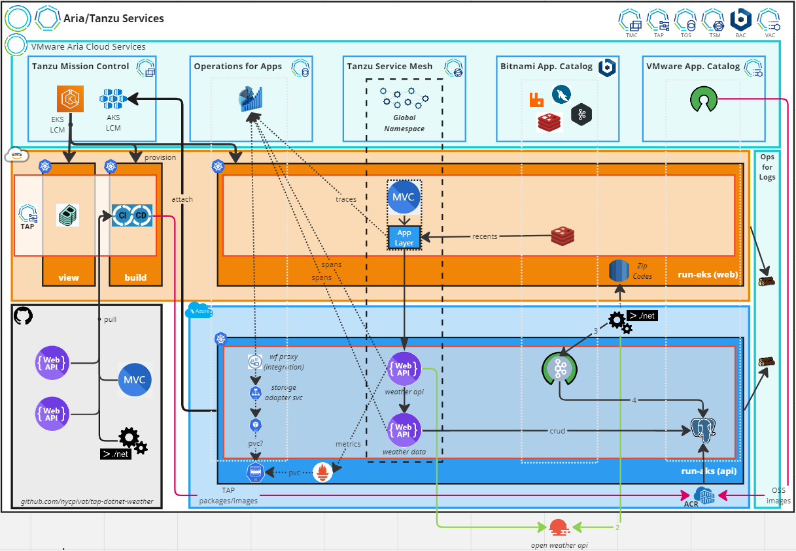

# Aria Tanzu Operations

This repository will demonstrate the automated deployment of a simple microservices application deployed on Kubernetes clusters across different cloud environments with the following VMware Aria and Tanzu products and services.

* Tanzu Application Platform (TAP), a multicluster installation consisting of a 1) View Cluster (tap-view), hosts a portal for developers to manage, monitor, and discover organizational resources in a single dashboard, a 2) Build Cluster (tap-build), hosts a complete end-to-end automated supply chain for compiling and building source code into OCI-compliant container images pushed to a registry and ready for deployment, and 3) Run Cluster(s), where the application and its dependent services are run and accessed by users.

* [Tanzu Mission Control](https://docs.vmware.com/en/VMware-Tanzu-Mission-Control/index.html), will be used to provision the multicluster TAP environment.

* [Tanzu Service Mesh](https://docs.vmware.com/en/VMware-Tanzu-Service-Mesh/index.html), where all of our applications and services hosted on TAP Run clusters will be encapsulated in a Global Namespace (GNS).

* [Aria Operations for Applications](https://docs.wavefront.com/), for monitoring resources and traces of both applications, services, and clusters across cloud environments.

* [VMware Application Catalog](https://docs.vmware.com/en/VMware-Application-Catalog/index.html), the repository hosting open-source software to support the application.

* [Tanzu Data Services](https://docs.vmware.com/en/Data-Management-for-VMware-Tanzu/index.html), will provide the database and caching services for the application.

* [Aria Operations for Logs](https://docs.vmware.com/en/VMware-Aria-Operations-for-Logs/index.html), will capture and store log data for each of the aforementioned services.

## System Architecture

## Getting Started

### Optional

1) The following is optional if you want to create a clean jumpbox and run a script to install all the required tools. First, clone this repository to your local machine and run the following script from within the cloned aria-operations folder. This script will generate the private SSH key and download it into the operator/keys folder. It will create the folder if it doesn't already exist. If you fork the repository, it is advised to include keys/ in the .gitignore file so you don't mistakenly push private keys to a public repository.

    [01-aria-operator-new.sh](01-aria-operator-new.sh)
    
This script will execute an AWS CloudFormation stack from the operator/config folder, that will create an EC2 instance in the specified region and the default network.

If successful, the script will out the DNS name of the new jumpbox. Copy and paste this into the aria-operator.sh file and overwrite the existing DNS name for the respective region. This file can be used for hosts created in other regions

2) Run sh aria-operator.sh. Once logged in, clone this same repository again, and specify the branch v1.6.1.

    git clone https://github.com/nycpivot/aria-operations -b v1.6.1

    * [02-tanzu-operator-prereqs.sh](02-tanzu-operator-prereqs.sh), this script installs all the prerequisites necessary for the workshop. You will need your AWS Access Key and Secret.

On the jumpbox, it is recommended to run these from the directory above the cloned repository, as some scripts might include relative path references.

    bash aria-operations/02-operator-prereqs.sh

## Prerequisites

All subsequent scripts retrieve secrets from AWS Secrets Manager. Or, you can edit the files and set these variables manually.

* pivnet-username, the username with access to network.pivotal.io or network.tanzu.vmware.com.
* pivnet-password, the password with access to network.pivotal.io or network.tanzu.vmware.com.
* pivnet-token, the refresh token created in network.pivotal.io or network.tanzu.vmware.com.
* tmc-[org-name]-token, the org-name in Aria Cloud Services for which the token applies.
* tsm-[org-name]-token, the org-name in Aria Cloud Services for which the token applies.
* registry-secret, any container registry that requires a username and password/secret to login.
* weather-bit-api-host, the url of the backend API for the frontend MVC app. You'll want to change the domain to match the domain of your EKS run cluster. For example, https://tap-dotnet-core-api-weather.default.run-eks.tap.nycpivot.com.
* weather-bit-api-key, the key to use for an external weather API service (optional).
* github-token, GitOps only.

03-tanzu-prereqs-aws.sh
04-tanzu-vpc-stack.sh

Follow the steps here to provision clusters in TMC.
Follow the steps here to install and configure the TAP clusters.

Now we are ready to provision our TAP clusters with TMC.

aria-operations/tmc/01-tap-clusters-aws-cli.sh
aria-operations/tmc/03-tap-clusters-azure-create-and-attach-cli.sh # creates the AKS cluster to attach

TAP
aria-operations/tap/cli/multi-tmc/01-tap-multi-aws-tmc-prereqs.sh
aria-operations/tap/cli/multi-tmc/02-tap-multi-azure-tmc-prereqs.sh

aria-operations/tap/cli/supply-chain/01-eks-ootb-basic-view-two-run.sh # for two run clusters (EKS, AKS)

Once these prerequisites have been met, the operator has the following options for the TAP installation.

## TAP Installation

### Architecture

* [Single Cluster](full-profile), all the components of TAP can be run on a single cluster, also known as Full Profile. This is the easiest and quickest setup for learning the basics of TAP.

* [Multi Cluster](multi-profile), the components are assigned to separate clusters based on their function, also known as Multi-Profile. This architecture is preferred for production environments. For example, application builds are managed separate from live application workloads.

The multi-profile architecture lends itself to scaling clusters differently according to usage. For example, application workloads on the Run cluster can scale more or less nodes depending on the usage, without the need to scale a build cluster.

For a complete reference architecture, see [TAP Reference Architecture](https://docs.vmware.com/en/VMware-Tanzu-Application-Platform/1.5/tap-reference-architecture/GUID-reference-designs-tap-architecture-planning.html)

### Installation Types

* [CLI](cli), relies solely on the Tanzu CLI and TAP plugins.
* [GitOps](gitops), uses mostly configuration files stored in a Git repository, and limited Tanzu CLI.

## Goals

The following is a common set of use-cases explored in this repository that most operators and developers will encounter.

* [TAP Services Toolkit](https://docs.vmware.com/en/Services-Toolkit-for-VMware-Tanzu-Application-Platform/index.html), used to make backend services, such as, databases, caches, queues, and more, easily discoverable across numerous disparate platforms and to bind the connection details to application workloads.
